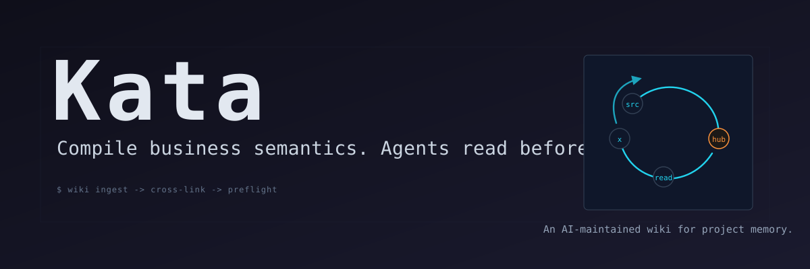
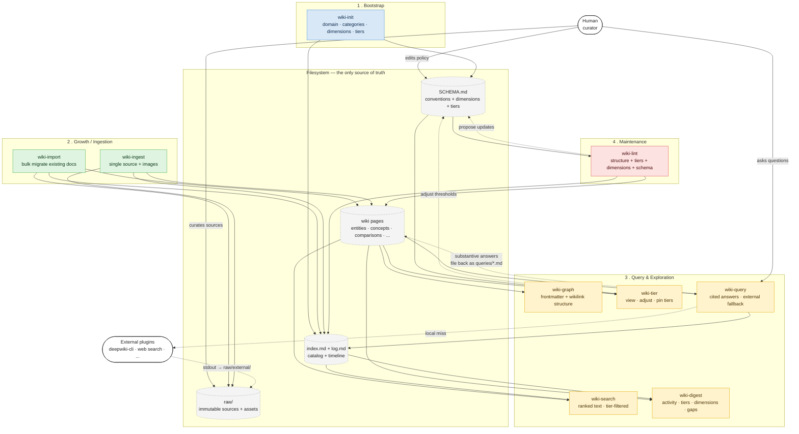

# Kata



## Quick install

Pick the tool you use:

```bash
# Claude Code (recommended, plugin path)
claude /plugin marketplace add surebeli/kata
claude /plugin install kata@kata

# OR — Codex CLI
git clone https://github.com/surebeli/kata ~/kata
cd ~/kata && python scripts/install_codex_skills.py
export KATA_HOME=~/kata
```

Then in any project directory:

```bash
# Initialize a wiki for your project (interactive: picks categories per domain)
claude /kata:wiki-init
```

You now have 13 skills (`wiki-init`, `wiki-ingest`, `wiki-search`,
`wiki-graph`, `wiki-tier`, `wiki-dream`, …) operating on a fresh wiki at
`~/.llm-wiki/<your-project>/`. Detailed install options below.

## What problem this solves

For a worked example of the failure mode kata addresses ("code-correct,
business-wrong" — when LLMs ship code that passes review but breaks
because of the team's local spec the model can't infer), see
[the Essay #1 draft](docs/essay-drafts/2026-05-13-essay1-code-quality-vs-business-DRAFT.md).
Three concrete bugs (B066/B070/B074), one wiki, +17 edges from one filed
query.


*The compounding moment.* Source data: 4-week dogfood on NECallKit
(multi-platform Electron + native SDK). See the essay above for the full
evidence chain.

## The loop


Each filed query becomes a hub. Hubs cross-link. The next agent's
session lands on the hub before it writes a line.

The remainder of this README covers: install options (A/B/C), the layered
product model, design lineage from Karpathy's LLM-Wiki gist, the 13-skill
contract, and operational guides (multi-machine sync, custom frontmatter
dimensions, memory-tier policy).

---

## What Kata is (the layered model)

| Layer | What it is |
|---|---|
| **Base** | [Karpathy's LLM-Wiki principle](https://gist.github.com/karpathy/442a6bf555914893e9891c11519de94f) — compiled once, kept current; humans curate, LLMs maintain; everything optional and modular. |
| **Core** | A **self-evolving knowledge system** built on the base: (1) a self-closing loop — ingest → cross-link → filed-query → compounding pages; (2) auto-dreaming — frozen pages resurface when their relevance returns. The wiki doesn't just persist; it grows back toward what's currently mattering. |
| **Phase 1** *(current)* | **AI-paired engineering.** Use the core wiki to compile project business semantics — thresholds, lifecycle invariants, domain conventions — so AI agents read project conventions before they write code. v1.4 → v1.11 ship this reach. |
| **Phase 2** *(designed, not yet implemented)* | **Team spec authoring + dispute resolution.** A self-closing loop for spec drafts, ratified positions, and the rejected alternatives — so future decisions don't re-litigate the same questions. |
| **Phase 3+** | Open. The core extends to new boundaries as we learn what compounds. |

The **product** is the Core + Phase reaches. Phase 1 is the first concrete
boundary; it's not the definition of Kata.

## The kata mastery curve

1. **Accept** — `wiki-init` lays down a starter kata: default categories,
   default schema, default rituals. You run the form as-is.
2. **Adapt** — you customize schema, add domain dimensions, extend skills for
   your project's vocabulary. The kata becomes yours.
3. **Transcend** — the form fades. Your AI agents brief themselves, maintain
   cross-links, resurface frozen knowledge when it matters again. The workflow
   is invisible; only the work remains.

The wiki is **compiled once and kept current** (not RAG). The human curates
sources and asks good questions; the AI does all the bookkeeping — reading,
summarizing, cross-referencing, filing, maintaining consistency. You (almost)
never write wiki pages yourself.

13 skills span ingest → search → graph → dream → sync — see the skill index
further down. The product is the kata; the wiki is what it produces.

---

## Design lineage

This plugin implements Karpathy's original concept and extends it with three
systems he left open. The table below shows which ideas come from the original
and which are plugin extensions.

### From Karpathy's original

| Idea | Original quote / reference |
|------|---------------------------|
| Compiled once, kept current (not RAG) | _"Unlike RAG... the wiki is compiled once and then kept up to date"_ |
| Human curates, LLM maintains | _"You curate sources and ask good questions, the LLM does the rest"_ |
| `raw/` immutable layer | _"You don't modify raw source material"_ |
| `index.md` — read index first | _"The LLM reads the index first to find relevant pages"_ |
| `log.md` — append-only action log | _"A chronological log of all actions taken"_ |
| Ingest: 10–15 pages per source | _"A single source can touch 10-15 pages"_ |
| Query results file back and compound | _"Queries compound in the wiki just like ingested sources"_ |
| Lint: stale content + data gaps | _"Lint also finds data gaps that could be filled with a web search"_ |
| Schema co-evolves with the wiki | _"The schema... co-evolves along with the wiki over time"_ |
| Git repo by default | _"The wiki directory is just a git repo"_ |
| Obsidian as the IDE | _"Obsidian is the IDE. The LLM is the programmer."_ |
| Everything optional and modular | _"Pick what's useful, ignore what isn't"_ |
| qmd for scaling search | _"qmd... for search at scale"_ |
| Web search to fill gaps | _"The LLM is good at suggesting new questions to investigate"_ |

### Plugin extensions (this project)

| Extension | What it adds | Why |
|-----------|-------------|-----|
| **SCHEMA.md as authoritative config** | All conventions in one file; agent reads and enforces rather than hardcoding | Karpathy said schema co-evolves — we formalized _where_ it lives and _who_ enforces it |
| **Interactive domain-specific init** | `wiki-init` proposes categories per domain (research/book/business/personal) | Karpathy's structure is intentionally abstract — a real tool needs a concrete bootstrapper |
| **Bulk import** (`wiki-import`) | 5-phase migration from Obsidian/Notion/Confluence/folders with checkpoint/resume | Original assumes you start fresh; most users have existing notes |
| **Image handling** in `wiki-ingest` | Auto-download referenced images to `raw/assets/`, rewrite to local paths | URLs rot; Karpathy didn't specify image handling |
| **Structured graph queries** (`wiki-graph`) | Frontmatter filters, BFS neighbors, shortest-path, hubs/orphans — no persistent graph DB | The `[[wikilink]]` graph is implicit in Karpathy's design; we made it queryable |
| **Custom frontmatter dimensions** | Domain-specific fields (e.g. `version:`) declared in SCHEMA.md, prompted during ingest | Karpathy mentions frontmatter but doesn't specify extensibility |
| **Three-tier memory aging** | `active`/`archived`/`frozen` tiers computed on-the-fly from source dates | Karpathy notes "stale content" in lint but doesn't propose a temporal model |
| **External fallback plugins** | `.wiki-plugins.yaml` registers CLI tools (deepwiki-cli, web search) as `wiki-query` fallback | Karpathy mentions web search for gaps; we generalized to any external tool with a closed-loop ingest pipeline |
| **Multi-format query output** | markdown / table / slides (Marp) / chart (matplotlib) / canvas (Obsidian) | Original doesn't specify output formats |
| **Plugin packaging** | `.claude-plugin/` marketplace for Claude Code, copy-based `AGENTS.md` for Codex CLI, single-file `SKILL.md` for any LLM | Karpathy's concept is tool-agnostic; this wraps it for specific platforms |

### What we deliberately did NOT add

- **Persistent graph database** — the filesystem is the graph; scanning hundreds of pages takes milliseconds
- **Auto-pruning of frozen content** — planned as "auto-dreaming" in v2; frozen = parked, not deleted
- **Embedding-based semantic search** — deferred to qmd; the built-in 3-pass scan handles Karpathy's sweet spot (~100 sources)
- **Multi-user access control** — the wiki is a git repo; use branches and PRs for collaboration

---

## Two ways to use this

**Simple path (3 steps).** Just want the wiki idea, no plugin infrastructure?
1. Copy [`SKILL.md`](SKILL.md) into a fresh chat with any LLM
2. Ask the model to run `wiki-init` in your target directory
3. Drop sources into `raw/`; ask the model to ingest, search, query

The standalone prompt has the full system. Skip the rest of this README.

**Full plugin path.** Want versioned skills, slash commands, scripts, and
schema validation in Claude Code? Continue below.

## How this differs from neighbors


|                          | This plugin                          | Obsidian Copilot / Smart Connections | MCP memory servers          | RAG / vector DB             |
| ------------------------ | ------------------------------------ | ------------------------------------ | --------------------------- | --------------------------- |
| Source of truth          | Your markdown files                  | Your markdown files                  | Server-side store           | Embedding index             |
| Compiled or per-query?   | Compiled once, kept current          | Per-query retrieval                  | Per-query retrieval         | Per-query retrieval         |
| Cross-references         | Written into pages on ingest         | Computed from embeddings             | None or schema-typed        | None                        |
| Schema co-evolves        | Yes (SCHEMA.md, agent-proposed)      | No                                   | No                          | No                          |
| Works offline            | Yes (no embedding model needed)      | Embedding model required             | Server required             | Embedding model required    |

The wiki **bakes synthesis into the artifact**. RAG and chat memory rebuild it
on every query — fine for fluid retrieval, but the cross-references are never
written down, so they don't compound.

## Installation

kata ships as three parallel install paths — pick the one matching your
LLM tooling. All paths give you the same 13 skills and the same wiki
filesystem layout.

| Path | Tool | Install location | Scope |
|------|------|------------------|-------|
| A | Claude Code (recommended) | `~/.claude/plugins/` (managed by `claude /plugin install`) | Global |
| B | Codex CLI | `~/.codex/skills/` + `~/kata/` (generated skills + env var) | Global |
| C | Standalone | Pasted into LLM session as system prompt | Per-session |

All three install kata **once globally** (or once per session for C); the
wiki content lives separately at `~/.llm-wiki/<project>/` regardless of
which path you pick. kata's filesystem layout, skill contracts, and
SCHEMA.md format are identical across all three.

**Prerequisites for any path:**
- Git ≥ 2.20 (for the v1.8 sync custom merge driver `merge=` attribute support)
- Python 3.10+ (deterministic scripts under `plugin/scripts/`); pure stdlib,
  no `pip install` needed

### Path A — Claude Code (plugin + marketplace)

The recommended install for Claude Code 2025+ users. Two-line setup:

```bash
# 1. Register this repo as a marketplace (clones it into ~/.claude/plugins/)
claude /plugin marketplace add surebeli/kata

# 2. Install the kata plugin from the marketplace
claude /plugin install kata@kata
```

After install, the 13 skills appear as slash commands:
`/kata:wiki-init`, `/kata:wiki-ingest`, `/kata:wiki-sync`, etc.

**Verify install:**

```bash
claude /plugin list                       # kata should appear
claude /kata:wiki-init --domain "test" # interactive bootstrap should fire
```

**Local-clone alternative** (for hacking on the plugin):

```bash
git clone https://github.com/surebeli/kata
cd kata
claude /plugin marketplace add .          # add this clone as a marketplace
claude /plugin install kata@kata
# Edits in ./plugin/skills/ are picked up live (no reinstall needed)
```

**Update / uninstall:**

```bash
claude /plugin update kata             # pull latest from marketplace
claude /plugin uninstall kata          # remove (wiki content stays put)
```

### Path B — Codex CLI (global install, recommended)

Codex CLI doesn't have a plugin marketplace. Instead, it discovers
user-installed skills from a skills root (commonly `~/.codex/skills/`).
kata is a global tool (operates on `~/.llm-wiki/<project>` no matter
where you run Codex from), so the right install pattern is:

1. clone this repo somewhere stable
2. point `KATA_HOME` at that clone
3. generate Codex-ready skills into your Codex skills directory

`plugin/AGENTS.md` is **not** the skill registry for Codex. It contains
shared instructions that the installer injects into each generated skill.

```bash
# 1. Clone kata to a stable home location
git clone https://github.com/surebeli/kata ~/kata

# 2. Set KATA_HOME so installed skills can resolve plugin/scripts/*
echo 'export KATA_HOME="$HOME/kata"' >> ~/.bashrc   # or ~/.zshrc
#    Windows PowerShell:
#    setx KATA_HOME "$env:USERPROFILE\kata"

# 3. Install kata into Codex's discovered skills directory
python ~/kata/scripts/install_codex_skills.py
# Optional explicit destination:
# python ~/kata/scripts/install_codex_skills.py --dest ~/.codex/skills
```

Restart Codex after installing or updating kata. New skills are
loaded at session start, so the current session will not hot-load them.
Because Codex CLI has no plugin marketplace update prompt, generated
skills include a Codex update check: compare the installed skill version
with `$KATA_HOME/plugin/.claude-plugin/plugin.json`; if they differ, run
`git pull`, rerun `python scripts/install_codex_skills.py`, and restart
Codex.

**Verify install:**

```bash
ls ~/.codex/skills/wiki-sync/SKILL.md
ls ~/kata/plugin/scripts/wiki_sync.py
echo "$KATA_HOME"                          # should print ~/kata
codex                                          # restart; new session should list kata skills
```

**Update / uninstall:**

```bash
cd ~/kata && git pull                       # pulls plugin updates
# Reinstall generated skills after pulling
# python ~/kata/scripts/install_codex_skills.py
#
# Uninstall: remove ~/.codex/skills/wiki-* and then
# rm -rf ~/kata  (wiki content at ~/.llm-wiki/ is independent and
# stays put — it's your data, not the plugin)
```

> **Per-project alternative.** If you only want kata active in one
> Codex CLI project (or want different kata versions per project),
> use `scripts/install_codex_skills.py --dest <project>/.codex/skills`
> or another project-local Codex skill root your environment loads. Do
> not assume copying only `plugin/AGENTS.md` will register skills. For
> the typical "personal tool, one install, multiple projects" case, the
> global install above is cleaner.

### Path C — Standalone (any LLM)

For one-off use with Claude.ai, ChatGPT, Cursor, or any LLM with a chat
interface — paste [`SKILL.md`](SKILL.md) into the session as a system prompt
or first message:

```bash
# Just one file. Copy its contents into your LLM session.
cat SKILL.md | clip     # Windows: copies to clipboard
cat SKILL.md | xclip    # Linux
cat SKILL.md | pbcopy   # macOS
```

`SKILL.md` is self-contained — every skill's prose, every guard, every
limitation. No external file dependencies. The LLM will follow the same
schema and produce the same wiki layout as Path A or B.

**Trade-offs vs A/B:**
- ✅ No install, works with any LLM
- ✅ Always the latest skill set (autogenerated table is in sync)
- ❌ No deterministic Python scripts (LLM has to recompute search ranking,
  graph queries, etc. each call) — fine for ≤ 100-page wikis, slow at scale
- ❌ No `wiki-sync` automation — sync needs the `wiki_sync.py` script;
  Path C wikis can still git pull/push manually but skip the custom
  driver auto-merge

### After install (any path)

Verify the skill set is wired:

```bash
# Claude Code: plugin marketplace install
ls ~/.claude/plugins/kata/plugin/skills/ 2>/dev/null

# Codex CLI: generated user skills
ls ~/.codex/skills/wiki-* 2>/dev/null
```

Then jump to **Quick start** below to bootstrap your first wiki.

---

## Multi-project wiki layout

Global installs resolve wiki roots per project. Recommended layout:

```text
~/.llm-wiki/
├── common/
├── necall/
└── rtc/
```

Each child directory is a full independent wiki with its own `SCHEMA.md`,
`index.md`, `log.md`, `raw/`, `dreaming/`, watcher queue, and memory-tier
settings. If no project is specified or detected, skills use
`~/.llm-wiki/common`.

Path resolution order:

1. Explicit `--path` / `--wiki`
2. `WIKI_PATH`
3. Current directory already inside a wiki root
4. `LLM_WIKI_PROJECT` under `LLM_WIKI_HOME` (default `~/.llm-wiki`)
5. Project-local `.llm-wiki.yaml` / `.kata.yaml`
   *(single wiki per file; for multi-wiki coexistence on one machine see
   step 6 and the section "Multiple wikis on one machine" below)*
6. `~/.llm-wiki/registry.yaml`
7. Git root name as `~/.llm-wiki/{repo-name}`
8. Legacy `~/.kata/config.yaml`
9. `~/.llm-wiki/common`

Bind a project repository explicitly:

```yaml
# .llm-wiki.yaml in the project repo
project: necall
# or:
wiki_path: ~/.llm-wiki/necall
```

### Multiple wikis on one machine

`.llm-wiki.yaml` is a **single-path cache**: one file binds the surrounding
directory to exactly one wiki root. Listing multiple `wiki_path:` entries
in the same file does **not** work — the parser keeps only the last one it
sees. To host several wikis side by side, pick one of the patterns below.

> **Git hygiene.** When the project repo is git-managed, add
> `.llm-wiki.yaml` to its `.gitignore`. The binding is per-machine state
> (absolute paths differ across Windows/macOS/Linux; even portable
> `~/...` values vary per developer), and checking it in causes
> cross-machine conflicts and leaks each maintainer's local wiki layout.
> Prefer the global `~/.llm-wiki/registry.yaml` (also outside the repo)
> when you need shared, reproducible mappings.

**Layout.** Each wiki is an independent directory under `~/.llm-wiki/`:

```
~/.llm-wiki/
├── common/         # default catch-all
├── necall/         # NECallKit project wiki
├── research/       # research / reading notes
└── playground/     # side-project sandbox
```

**Pattern A — one `.llm-wiki.yaml` per project repo.** Drop a binding in
each project root; whichever project you `cd` into resolves to its own
wiki:

```yaml
# /path/to/NECallKit/.llm-wiki.yaml
wiki_path: ~/.llm-wiki/necall
```
```yaml
# /path/to/research-notes/.llm-wiki.yaml
project: research
```

**Pattern B — a single global `~/.llm-wiki/registry.yaml`.** Preferred
when you maintain many projects; no per-repo file required:

```yaml
projects:
  /path/to/NECallKit:
    wiki_path: ~/.llm-wiki/necall
  /path/to/research-notes:
    project: research
  /path/to/playground:
    wiki_path: ~/.llm-wiki/playground
```

**Pattern C — hybrid with nested override.** A monorepo binds the default
wiki, but a submodule binds its own. The resolver walks up from cwd and
takes the **innermost** binding (parent bindings only apply when no closer
one exists):

```
/path/to/monorepo/.llm-wiki.yaml              → wiki_path: ~/.llm-wiki/main
/path/to/monorepo/external/sdk/.llm-wiki.yaml → wiki_path: ~/.llm-wiki/sdk
```

Running a skill from `monorepo/external/sdk/` resolves to `sdk`; from the
monorepo root it resolves to `main`. The same precedence applies to git
submodules.

**Per-shell override.** To temporarily switch wikis without editing any
binding:

```powershell
$env:WIKI_PATH = "$env:USERPROFILE\.llm-wiki\research"
# or
$env:LLM_WIKI_PROJECT = "research"
```

These short-circuit the binding/registry lookup for the current session
only. `LLM_WIKI_HOME` (default `~/.llm-wiki`) is the parent directory that
`LLM_WIKI_PROJECT` resolves against:

```powershell
# optional — only needed if you don't want the default ~/.llm-wiki parent
$env:LLM_WIKI_HOME = "$env:USERPROFILE\.llm-wiki"
```

Initialize a project wiki:

```powershell
py -3 .\scripts\wiki_init.py `
  --domain "development documentation knowledge base" `
  --categories architecture,decisions,features,runbooks,discussions,queries
```

Run that from inside a git repo to create/use `~/.llm-wiki/{repo-name}`.
Outside a git repo, pass `--path`, set `LLM_WIKI_PROJECT`, or accept the
fallback `~/.llm-wiki/common`. Query/import/dream commands do not create
an uninitialized wiki; run `wiki-init` first for each project.

## Skills

| Skill | Invocation | Origin | Purpose |
|-------|-----------|--------|---------|
| wiki-init | `/kata:wiki-init` | extension | **Interactive** bootstrap — domain, categories, custom dimensions, tier config |
| **wiki-import** | `/kata:wiki-import <path>` | extension | Bulk-import existing docs (Obsidian/Notion/Confluence/folder) |
| wiki-ingest | `/kata:wiki-ingest <source>` | Karpathy | Integrate a source (text + images + custom dimension prompts) |
| **wiki-search** | `/kata:wiki-search <query>` | Karpathy | Ranked text search; default `--tier=active`; scales to qmd / MCP |
| **wiki-graph** | `/kata:wiki-graph [modes]` | extension | Structured graph queries — neighbors, shortest-path, hubs, frontmatter filters |
| wiki-tier | `/kata:wiki-tier` | extension | View/adjust memory-tier distribution, thresholds, pin overrides |
| **wiki-digest** | `/kata:wiki-digest` | Karpathy | Activity, tier distribution, stale dimensions, coverage gaps |
| wiki-query | `/kata:wiki-query <question>` | Karpathy | Answer with citations; file back; fallback to external plugins |
| wiki-lint | `/kata:wiki-lint` | Karpathy | Structure + content + tier/dimension checks + SCHEMA.md evolution |

> **Origin column**: "Karpathy" = concept described in the original; "extension" = added by this plugin. Even Karpathy-origin skills have been significantly expanded (image handling, tier filtering, external fallback, etc.)

## How it fits together

Four phases, one source of truth (your markdown files). The human curates what
goes into `raw/`; the agent owns everything above it.



### Best-practice loops

- **Daily loop** — drop a source in `raw/` → `wiki-ingest` → glance at
  `wiki-digest --since=1d`. Ten to fifteen pages touch per ingest; that's the
  compounding effect.
- **Question loop** — `wiki-search` (or `wiki-graph --neighbors`) to scope
  → `wiki-query` to answer. Substantive answers **file back** as
  `queries/*.md` and become new nodes in the graph.
- **Exploration loop** — `wiki-graph --shortest-path A,B` surfaces **bridge
  concepts** between two entities you didn't realize were connected. Promote
  the interesting ones to `comparisons/` via `wiki-query --file`.
- **Weekly loop** — `wiki-digest` for the state of the wiki, then
  `wiki-lint` for structure + content gaps + schema-evolution proposals.
  `wiki-lint --fix` applies the safe ones; you approve the rest.
- **Golden rule** — SCHEMA.md is authoritative. If the agent wants a new tag
  or page type, it proposes a SCHEMA.md diff instead of drifting. The wiki
  stays coherent as it grows.

`wiki-search` vs. `wiki-graph` — use `wiki-search` when you're asking _"what do
we have on X?"_ (text relevance). Use `wiki-graph` when you're asking _"what is
connected to X?"_ or _"which pages match these frontmatter properties?"_
(structure). They complement each other.

### Answer confidence

`wiki-query` should treat confidence as an explicit part of the answer, not as
an invisible model vibe. The score is an operational confidence estimate: how
well the wiki supports the answer with relevant, current, citable, actionable,
and verifiable pages. It is not a probability that the answer is universally
true.

| Confidence | Range | Meaning | Expected behavior |
|------------|-------|---------|-------------------|
| **High** | 0.80-1.00 | The wiki has directly relevant pages, clear citations, current source context, and verification or decision evidence | Answer directly, cite sources, list the verification boundary |
| **Medium** | 0.50-0.79 | The wiki has useful coverage but is missing some branch/version/platform context, proof, or validation | Answer with caveats, name the missing evidence, suggest a targeted ingest or check |
| **Low** | 0.20-0.49 | The wiki has only partial context or weakly related pages | Treat as a partial answer; avoid decisive claims; identify the smallest source batch needed |
| **No answer** | 0.00-0.19 | Search returned nothing relevant, only keyword noise, or stale/conflicting material with no resolution path | Say the wiki cannot answer yet; search external/local sources, then ingest the resulting evidence |

A page match is not automatically an answer. A result that only shares a
keyword or module name is a **context hit**, not a high-confidence answer. A
query counts as answered only when the retrieved pages support a concrete next
step and explain the relevant boundaries.

The same rule applies when the wiki appears to have a strong old answer but the
queried reality may have changed. In software docs this often appears as a
requirement or product-rule change; in a general wiki it may be a changed fact,
policy, price, schedule, API, version, organization, conclusion, or world
state. If the user explicitly says the truth state changed, `wiki-query` should
present the old wiki-backed position, the new stated position, the
contradiction, and the evidence needed before treating the new answer as
durable. If the user does not say it changed but the query implies a
contradiction with an existing rule or fact, the agent should ask a short
confirmation question before giving a decisive answer. An old page match is not
High confidence when the query may be changing that page's judgment.

Use this checklist when assigning confidence:

- **Relevance** — does it match the specific entity, API, platform, bug shape,
  or decision being asked about?
- **Source strength** — is it backed by specs, final reports, reviewed fixes,
  code paths, or primary notes rather than incidental mentions?
- **Freshness** — does it match the current repo, branch, base/default branch,
  version, release context, or other time-sensitive truth state?
- **Actionability** — can the answer guide the next edit, investigation,
  review, or decision?
- **Verifiability** — does it include tests, manifests, logs, reproduction
  steps, review outcomes, or other evidence that can be checked?

### Query-to-ingest closed loop

This is the canonical dogfood loop for turning a question into durable wiki
knowledge. The new material does not have to be a new knowledge domain: it can
be a fresh fix record, review note, development log, test result, generated
artifact check, or branch-specific decision from the current target repository.

```markdown
## Query record

Input:
- User question: "Why does the regional rollout checklist still mention the old approval rule?"

Initial wiki hit:
- Pages found: [[regional-rollout-approval-query]],
  [[approval-policy-change-log]]
- Hit grade: partial answer
- Confidence: 0.62 (Medium)

Gap:
- The wiki explains the old approval boundary, but not the latest policy note
  or the exact verification evidence for this rollout.

Possible changed truth state:
- If the user says the requirement changed, record both the old wiki rule and
  the new stated rule before solving.
- If the user does not say it changed but the requested behavior contradicts
  the wiki, ask for confirmation first.
- In non-code domains, use the same pattern for changed facts, policies, prices,
  schedules, APIs, versions, organizations, conclusions, or world states.

While solving:
- Ask the agent or LLM doing the fix to save a short, ingestible record in the
  target repo: problem, root cause, changed files, decision boundaries, tests,
  generated artifacts checked, and remaining risks.
- Prefer durable files such as fix notes, review summaries, final reports, or
  test logs over chat-only memory.

Curated import:
- Search the target repo docs/code/history for only the missing cluster.
- Import or ingest the new fix/development records that explain the gap.
- Use a small curated batch, not the whole repository.
- Prefer `wiki-ingest` for one file and `wiki-import` for a small curated folder.

Distilled query:
- Run `wiki-query --file` to create or update `queries/{descriptive-name}.md`.
- The filed query includes the final answer, sources used, missing evidence,
  verification checklist, and reusable entry points.

Post-check:
- Re-run `wiki-search` to confirm the new answer is retrievable.
- Run `wiki-graph` / `wiki-lint` to catch broken links or structural drift.
- Commit and push the wiki so the knowledge update is reviewable and durable.

Reusable:
- yes, if the filed query becomes the first page to read for the next similar
  bug or decision.
- no, if it was a one-off lookup with no generalizable boundary or lesson.
```

For software dogfood, this loop should also record whether the answer depended
on repo, branch, base branch, default branch, generated artifacts, or a promote
decision. A same-repo bugfix or development log can be the missing source of
truth; branch-aware context is part of answer confidence.

When confidence is below High, `wiki-query` should also guide the user to make
the solving agent preserve the missing evidence as documentation. The user does
not need to write wiki pages; they only need to keep the fix/development record
somewhere durable so the wiki maintainer can ingest it.

## Quick start

```
# 1. Initialize — wiki-init is INTERACTIVE: it asks about your domain and
#    proposes categories that fit (entities/concepts for research,
#    characters/plot for fiction, people/projects for business, etc.)
/kata:wiki-init --path=~/research-wiki --domain="transformer ML research"

# 2. git init is suggested automatically — the wiki is a git repo by default,
#    version history for free.

# 3. Ingest your first source (images auto-downloaded to raw/assets/)
/kata:wiki-ingest https://arxiv.org/abs/2301.00000

# 4. See what was compiled
/kata:wiki-digest

# 5. Search for a topic
/kata:wiki-search "attention mechanism"

# 6. Explore the graph around a page (BFS over [[wikilinks]])
/kata:wiki-graph --neighbors attention --depth=2 --format=mermaid

# 7. Check memory tier distribution
/kata:wiki-tier --show

# 8. Ask a question — substantive answers file back as queries/{name}.md
/kata:wiki-query "How does flash attention differ from standard attention?"

# 9. Periodic health check (structure + content gaps + schema evolution)
/kata:wiki-lint
```

## Common workflows

Examples below use Claude Code slash commands. In Codex CLI or standalone mode,
use the same skill names without the `/kata:` prefix.

### 1. Ingest a single document

```bash
# A URL
/kata:wiki-ingest https://example.com/article

# A local file
/kata:wiki-ingest ~/Downloads/attention-is-all-you-need.pdf

# Skip the discussion step in more automated flows
/kata:wiki-ingest ~/notes/meeting-2026-05-08.md --no-discuss
```

Use this when you have one source to add: a web page, PDF, markdown file, text
file, or pasted text. `wiki-ingest` saves the raw source into the appropriate
`raw/` subdirectory, downloads referenced images unless `--no-images` is set,
checks what pages already exist, then creates or updates wiki pages, `index.md`,
and `log.md`.

If SCHEMA.md defines custom dimensions, `wiki-ingest` prompts for them unless
you pass values up front:

```bash
/kata:wiki-ingest ~/notes/q2-review.md --set project=alpha,owner=ops
```

### 2. Bulk-import an existing document collection

```bash
# Initialize the target wiki once
/kata:wiki-init --path=~/company-wiki --domain="internal platform docs"

# Preview mapping + dedup before writing
/kata:wiki-import ~/exports/notion --format=notion --dry-run

# Run the real migration
/kata:wiki-import ~/exports/notion --format=notion
```

Use this when the material already exists outside the wiki: a Notion export, an
Obsidian vault, a Confluence dump, or a directory of markdown/text files.
`wiki-import` scans the whole tree, infers structure, deduplicates against
existing pages, and stores immutable originals under `raw/imported/`.

### 3. Resume an interrupted import or rerun an updated export

```bash
# Continue an interrupted bulk import from its checkpoint
/kata:wiki-import --resume

# Re-scan an updated export safely
/kata:wiki-import ~/exports/notion --format=notion --dry-run
/kata:wiki-import ~/exports/notion --format=notion
```

Use `--resume` only when a previous import was interrupted and
`.wiki-import-checkpoint.json` exists in the wiki root. For a fresh rerun, keep
the wiki working tree clean first (`git commit` or `git stash`), inspect the
plan with `--dry-run`, then run the real import. The import flow deduplicates
and merges against existing pages; you do not need to start a second wiki just
to re-scan the same corpus.

### 4. Drop many files into `raw/`, then ingest deliberately

```bash
# Start the watcher once
/kata:wiki-watch --start

# After copying files into raw/articles, raw/papers, or raw/external
/kata:wiki-watch --status
/kata:wiki-watch --drain
```

Use this when files are already in `raw/` and you want a queue plus a final
review step before the wiki changes. The watcher never mutates pages on its own;
`--drain` is the explicit handoff to `wiki-ingest`.

### 5. Distill query results into a new downstream wiki

```bash
# In the source wiki, force-file the synthesis you want to keep
/kata:wiki-query "What patterns recur across these launches?" --file
/kata:wiki-query "Compare agent memory approaches" --file --format=table

# Create a new target wiki for the distilled knowledge
/kata:wiki-init --path=~/agent-patterns-wiki --domain="agent product patterns"

# Import the filed syntheses, or a curated folder containing them
/kata:wiki-import ~/source-wiki/queries --format=markdown
```

`wiki-query --file` turns a good answer into a first-class wiki page under
`queries/`. If the goal is to build a smaller, more distilled downstream wiki,
treat those filed query pages, plus any curated `comparisons/` or canonical
pages, as the source corpus for a new `wiki-import`. If you only need the
synthesis in the same wiki, stop at `wiki-query --file`; no second wiki is
needed.

## Wiki structure (starter)

Categories are not hardcoded — `wiki-init` proposes them based on your domain.

```
{wiki_path}/
├── SCHEMA.md              # Conventions, dimensions, tiers, policies (USER-EDITABLE)
├── .wiki-plugins.yaml     # External plugin registry (optional)
├── index.md               # Content catalog with one-line summaries
├── log.md                 # Append-only action log
├── raw/                   # IMMUTABLE source material
│   ├── articles/
│   ├── papers/
│   ├── transcripts/
│   ├── assets/            # Downloaded images (auto-saved during ingest)
│   ├── imported/          # Immutable originals from wiki-import
│   └── external/          # Plugin output (auto-saved during query fallback)
└── {categories}/          # Defined by SCHEMA.md — fits your domain
                           # Research:  entities/, concepts/, comparisons/, queries/
                           # Book:      characters/, themes/, plot/, timeline/
                           # Business:  people/, projects/, decisions/, meetings/
                           # Personal:  journal/, topics/, patterns/, queries/
```

**SCHEMA.md is authoritative.** All conventions — page types, frontmatter fields,
tag taxonomy, page creation policy, cross-reference policy, page size limits, log
rotation, **custom dimensions**, and **memory-tier thresholds** — live there.
`wiki-init` writes a starter based on your domain; `wiki-lint` proposes updates
over time. The plugin reads and enforces SCHEMA.md rather than hardcoding opinions.

## Custom frontmatter dimensions

> Extension — Karpathy mentions frontmatter but doesn't specify extensibility.

SCHEMA.md's `custom_dimensions:` block lets you declare domain-specific
frontmatter fields — `version:` for software, `venue:` for research papers,
`mood:` for journals. Each dimension has a type, description, and `refresh_on`
schedule that controls when the agent prompts you for the value:

```yaml
custom_dimensions:
  - name: version
    type: string
    description: "Which product version does this source describe?"
    required: true
    refresh_on: [ingest, import]    # prompt every time a new source arrives
    applies_to: null                # null = all page types
```

- `wiki-ingest` / `wiki-import` — prompt per `refresh_on` schedule; `--set key=value` skips prompting
- `wiki-digest` — surfaces pages with stale values (for `refresh_on: [digest]`)
- `wiki-lint` — validates completeness and enum range
- `wiki-graph --query` / Obsidian Dataview — custom dimensions are queryable like any frontmatter

## Memory tiers (active / archived / frozen)

> Extension — Karpathy notes "stale content" in lint but doesn't propose a temporal model.

Raw content ages. The wiki distinguishes three tiers to keep queries focused:

| Tier | Default window | Behavior |
|------|---------------|----------|
| **active** | < 1 year | Default query surface — all skills return active-tier results |
| **archived** | 1–2 years | Accessible via `--tier=archived` or `--tier=all` |
| **frozen** | > 2 years | Cold storage — future auto-dreaming (v2) will revisit |

Tiers are computed **on-the-fly** from `published_at` (fallback `ingested_at`)
— never stored as frontmatter. Threshold changes take effect instantly. A wiki
page's tier = most-recent-tier across its cited sources (any active source pulls
the page into active). Manual `tier_override:` pins are supported.

```bash
# View distribution
/kata:wiki-tier --show

# Push active window to 18 months and preview the effect
/kata:wiki-tier --preview --set-active=540d

# Pin a canonical reference as permanently active
/kata:wiki-tier --pin=concepts/attention.md:active
```

## Auto-ingest from raw/ (the watcher)

> Extension — closes the "I dropped a file but forgot to ingest" gap.

Drop a file into `raw/articles/` (Web Clipper, `curl`, drag-and-drop) and
the watcher daemon enqueues it for ingestion. When you next open Claude
Code, `/wiki-watch --status` tells you what's pending; `--drain` processes
the whole queue in one command.

Detection is filesystem-only — the watcher reads `raw/` mtimes and nothing
else. **Drain is always explicit**: a misconfigured watcher cannot
silently mutate wiki pages because the script never invokes `wiki-ingest`
itself, only the skill does.

```bash
# Start the daemon (5s polling, 5s debounce — Web-Clipper-friendly)
/kata:wiki-watch --start

# Status anytime — works whether daemon is running or not
/kata:wiki-watch --status

# Process all pending files
/kata:wiki-watch --drain

# Stop the daemon
/kata:wiki-watch --stop
```

For headless use (cron, systemd, launchd, Task Scheduler), see
[`docs/watcher.md`](docs/watcher.md).

## Auto-dreaming

> Extension — the only kata feature that runs without you.

Frozen content doesn't have to stay frozen. As you ingest new sources,
old pages may become relevant again — an acquired company, a revived
architecture, a cited classic paper. Auto-dreaming runs weekly (or on the
cadence you set), reads the log.md increment since its last watermark,
and surfaces frozen/archived pages whose relevance score crossed the
threshold.

Filesystem-only by design: it reads `log.md` + page frontmatter dates
(`ingested_at` / `updated`), never file mtimes or chat sessions. So
`git clone` reproduces dreamer behavior on any machine — frontmatter is
in git, mtimes are not.

```bash
# Weekly run lands in dreaming/{date}.md for your morning review
/kata:wiki-dream

# Promote selected candidates back to active tier
/kata:wiki-dream --apply --pages 1,3,5

# Why was X suggested (or not)?
/kata:wiki-dream --explain mosaic
```

v1.6 ships with the `co-occurrence` strategy benchmarked under the
`market_research` fixture id, with the first dogfood template narrowed
to LLM application innovation: products, frameworks, patterns, research
briefs, and filed-back discussions. Precision ≥ 0.7 and recall ≥ 0.5
are gated in CI. Other domains and strategies (citational, structural,
temporal) land in v1.8+. See [`docs/dreaming.md`](docs/dreaming.md) for
full design and [`docs/dogfood-guide-v1.6.md`](docs/dogfood-guide-v1.6.md)
for the dogfood loop.

> **Dogfood status (2026-05-07):** v1.6 (dreaming) and v1.8 (sync)
> 4-week observation windows are **both Pending** on a real wiki —
> CI gates are green, qualitative gates unverified. Recommended plan:
> run both in parallel on the same wiki via cron line
> `wiki-sync --auto && wiki-dream`. See
> [`docs/dogfood-v1.6.md`](docs/dogfood-v1.6.md) (dreaming) and
> [`docs/dogfood-v1.8.md`](docs/dogfood-v1.8.md) (sync) for the
> combined startup checklist.

## Multi-machine sync (v1.8 MVP)

> Extension — Karpathy's wiki is a git repo by default, but doesn't say
> how to keep two laptops aligned. v1.8 adds `wiki-sync`: a custom
> merge driver for `log.md` (union+sort) plus per-machine sync reports
> outside the wiki repo to avoid self-conflict.

```bash
# 1. Bootstrap a sync-ready wiki (fresh)
/kata:wiki-init --path ~/.llm-wiki/myproject --enable-sync
# Or upgrade an existing wiki to v1.8:
python plugin/scripts/wiki_init.py --refresh-id --path ~/.llm-wiki/myproject

# 2. Initialize git and make the bootstrap commit. wiki-init writes
#    SCHEMA.md / .gitignore / .gitattributes but does NOT init git for you.
cd ~/.llm-wiki/myproject
git init -b main
git add .
git commit -m "wiki: init"

# 3. Add your remote and push the bootstrap commit
git remote add origin git@github.com:you/myproject-wiki.git
git push -u origin main

# 4. Clone on the second machine (replace HOME path as appropriate)
git clone git@github.com:you/myproject-wiki.git ~/.llm-wiki/myproject
# Both machines now share wiki_id from SCHEMA.md — sync's identity
# check will pass.

# 5. Sync interactively (lock + drivers + fetch + merge + push)
/kata:wiki-sync

# 6. Cron mode (chains with dream; conflict breaks the chain)
0 23 * * 0  cd ~/.llm-wiki/myproject && wiki-sync --auto && wiki-dream

# 7. Preview without side effects
/kata:wiki-sync --dry-run
```

**What v1.8 MVP gives you:**

- `merge_log.py` driver auto-merges `log.md` divergence as union+sort
  with canonical hash dedup (Files: order canonicalized; Step 1/2 order
  preserved). Same-triple-different-body kept both with `Sync-side:
  ours/theirs` annotations
- Local sync lock (`~/.kata/sync-{slug}.lock`) — same-machine
  reentry guard; cross-machine race goes through git push retry
- Force-push detect (compares fetch-pre and fetch-post `origin/<branch>`
  SHA ancestry) → never silently swallows history rewrite
- Wiki identity check via `wiki_id` UUID in SCHEMA.md (`## Identity`)
  — sync aborts on mismatch to prevent merging unrelated knowledge bases
- Per-machine sync reports under `~/.kata/sync-reports/{slug}/`
  (NEVER in the wiki repo — by design, so reports never self-conflict)
- Preflight refuses on active wiki-import (lock + checkpoint), in-flight
  git merge/rebase/cherry-pick, or held local sync lock
- `wiki-import` improvements: import-lock, dirty-tree refusal, phase 5
  single commit + push, success cleanup deletes checkpoint after commit
  (regardless of push outcome) so sync isn't persistently blocked

**What v1.8-full and v1.9 add:**

- `merge_index.py` driver (section-aware union of `index.md`) — v1.8-full
- True concurrent-barrier race test (subprocess-level barrier file
  with role-specific ready signals) — v1.8-full. The current MVP test
  (`T-sync-16-lite`) uses a sequential pre-push hook that's still strict
  enough to verify re-fetch + re-merge but isn't physically simultaneous.
- LFS support for `raw/papers/*.pdf` and the like — v1.9 backlog

See [`docs/PRD-v1.8-sync.md`](docs/PRD-v1.8-sync.md) for the full design
(7 review rounds, 42 findings closed, MVP ready as of 2026-05-07).

### Onboarding a second machine to an existing wiki

The flow above assumes you bootstrap a fresh wiki and *then* push to a
remote. The more common real case is that machine A has already been
ingesting for weeks (your distilled knowledge base) and you now want to
read/write the same wiki from machine B. Steps:

```bash
# ──────────── On machine A (the one that already has content) ────────────

# A.1 Make sure everything is committed and pushed.
cd ~/.llm-wiki/myproject
git status --short          # must be clean
git log @{u}..HEAD          # must be empty (no unpushed commits)
# If not clean: commit pending work; if ahead: git push

# ──────────── On machine B (the new machine) ────────────

# B.1 Install the plugin + Python 3.9+ + (optional) ne-git-commit.
#     On Windows, default `python` may be 2.7 — verify `py -3 --version`
#     and use `py -3` (or alias) for the wiki scripts.

# B.2 Clone the wiki into the multi-project layout (~/.llm-wiki/{project}).
mkdir -p ~/.llm-wiki
git clone git@github.com:you/myproject-wiki.git ~/.llm-wiki/myproject
# `wiki_id` in SCHEMA.md comes with the clone — DO NOT edit it by hand.
# It is what sync's identity check uses to confirm "same wiki, two machines".

# B.3 (Optional) Bind the wiki to your local project directory so kata
#     resolves it from the project root. Pick ONE of:
#
#     a) Per-project file in the project root:
echo 'wiki_path: ~/.llm-wiki/myproject' > /path/to/myproject/.llm-wiki.yaml
#
#     b) Global registry entry (preferred if you have many projects):
mkdir -p ~/.llm-wiki && cat >> ~/.llm-wiki/registry.yaml <<'EOF'
projects:
  myproject:
    wiki_path: ~/.llm-wiki/myproject
EOF
#
#     Hosting more than one wiki on this machine? Each project repo gets
#     its own `.llm-wiki.yaml`, or stack multiple entries under
#     `projects:` in the same registry. See README → "Multiple wikis on
#     one machine" for nested-binding / submodule examples.

# B.4 Verify by previewing a sync. This also auto-registers the log.md
#     custom merge driver in machine B's .git/config.
cd ~/.llm-wiki/myproject
/kata:wiki-sync --dry-run        # expect: up-to-date

# B.5 You are done. Day-to-day:
/kata:wiki-sync --dry-run         # before starting work, see if A pushed
/kata:wiki-sync                   # after committing, push and merge
```

**Important constraints when running two machines:**

- **Never hand-edit `wiki_id`** in SCHEMA.md. The clone brings it; the
  identity check refuses the sync if A and B drift. If you must reset
  the ID, use `wiki-init --refresh-id` and re-init *all* peers.
- **`dreaming/` does not have a merge driver yet** (v1.8-full / v1.9
  backlog). If both machines run `wiki-dream` on the same date, both
  will produce `dreaming/YYYY-MM-DD.md` and you get a normal git
  conflict. Mitigations: (a) run the dream cron on only one machine,
  or (b) stagger cron times so machine B picks up A's dream file via
  sync before its own run starts.
- **`~/.kata/sync-reports/{slug}/` is per-machine** by design. It is
  outside the wiki repo so it never self-conflicts. Each machine grows
  its own log; `rm -r` periodically if you want.
- **`.wiki-import-lock` / `.wiki-import-checkpoint.json` block sync** —
  if you stop machine A mid-import, sync on B will refuse until A
  resolves the import. Run `wiki-import --resume` or clean the
  checkpoint on A first.
- **A and B are now both writers**. Stagger heavy ingest sessions, or
  use `wiki-sync` before/after each work block. Push race is bounded
  (3 retries, 1/2/4s backoff); beyond that you re-run manually.

If your wiki has private content, your remote should be private too
(`raw/` is bulk-imported source material, often the most sensitive
part). The plugin and scripts themselves are open source, but the wiki
content git repo lives in *your* remote.

## External fallback plugins

> Extension — Karpathy mentions web search for gaps; we generalized to any
> external CLI tool with a closed-loop ingest pipeline.

When `wiki-query` can't answer from local knowledge, it can call external
tools registered in `.wiki-plugins.yaml`:

```yaml
plugins:
  - name: deepwiki-cli
    description: "Search target codebase for implementation details"
    trigger: on_empty         # fire when wiki-search returns 0 hits
    auto_run: false           # show argv + confirm before executing
    # argv: literal token list. Each element is one execve argument; no shell.
    # Substitution is per-token via {query}, {wiki_path}, {date}, vars.*.
    # Tokens containing shell metachars are refused after substitution.
    argv:
      - deepwiki-cli
      - search
      - "--repo={repo_path}"
      - "--query={query}"
      - "--format=markdown"
    vars:
      repo_path: "/path/to/target/repo"
```

> **v1.4 breaking change.** The pre-v1.4 `command_template:` (string-then-shell)
> field was removed because a prompt-injected query could land in `/bin/sh`.
> v1.4+ refuses to run any plugin that still uses it; migrate to `argv:`.
> See [`plugin/PLUGINS.md`](plugin/PLUGINS.md) for full migration notes.

**Flow**: query miss → plugin command → stdout saved to `raw/external/` →
`wiki-ingest` processes it → wiki pages grow → future queries hit local first.

The plugin output becomes a new raw source and enters the full ingest pipeline
(categorization, tagging, cross-referencing, tier-stamping). See `PLUGINS.md`
for the full manifest specification and more examples.

## Works with Obsidian

> From Karpathy — _"Obsidian is the IDE."_

The wiki is a drop-in **Obsidian vault** — no conversion needed:

- `[[wikilinks]]` render as clickable
- **Graph view** shows the shape of the wiki (hubs, orphans, clusters)
- **Dataview** plugin runs queries over YAML frontmatter (including custom dimensions)
- **Web Clipper** extension is the fastest way to get web sources into `raw/articles/`
- **Marp** plugin renders `wiki-query --format=slides` output inside Obsidian

## Git integration

> From Karpathy — _"The wiki directory is just a git repo."_

The wiki is a git repo by default. `wiki-init` suggests `git init` as its final
step. Every `wiki-ingest` and `wiki-query --file` produces clean diffs. Team
wikis can use branches for proposed changes before merging.

## Works with

- **Claude Code** — via `.claude-plugin/marketplace.json` + `plugin/.claude-plugin/plugin.json`
- **Codex CLI** — via generated skills under `~/.codex/skills` (see `scripts/install_codex_skills.py`)
- **Any LLM** — copy `SKILL.md` as a standalone prompt
- **Obsidian** — as a vault (read-only for you, read-write for the LLM)

## Scaling

> From Karpathy — he explicitly mentions qmd and suggests vibe-coding a search
> script as the need arises.

- **< 100 pages** — built-in `wiki-search` (index + frontmatter + content scan)
- **100–500 pages** — same, but run `wiki-lint` often to keep `index.md` current
- **500–2000 pages** — install [qmd](https://github.com/tobi/qmd) (BM25 + vector
  hybrid with LLM re-rank); `wiki-search` auto-detects and shells out
- **2000+ pages** — qmd in MCP server mode; agent calls directly

## Contributing

If you're hacking on the plugin scripts or skills:

```bash
# Enable the smoke-test pre-commit hook
git config --local core.hooksPath .githooks

# Run smoke tests manually (matches CI)
python tests/run_smoke.py

# Regenerate the autogenerated skill table after adding a new skill
python scripts/build_skill_md.py
```

The hook runs `tests/run_smoke.py` and `scripts/build_skill_md.py --check`
on every commit that touches scripts, skills, schema, or tests. Use
`git commit --no-verify` to skip when iterating.

## Origin

Concept by [Andrej Karpathy](https://gist.github.com/karpathy/442a6bf555914893e9891c11519de94f)
(May 2025). Plugin design pattern from [PhoenixTeam](https://github.com/surebeli/PhoenixTeam).

This plugin aims to be a **faithful, opinionated implementation** of Karpathy's
intentionally abstract concept. Where the original says _"everything mentioned
above is optional and modular"_, we made concrete choices (SCHEMA.md as the single
config, interactive domain-specific init, three-tier memory aging) while preserving
the core invariants: filesystem as the only source of truth, raw immutability,
human curates / LLM maintains, knowledge compiles once and compounds.
