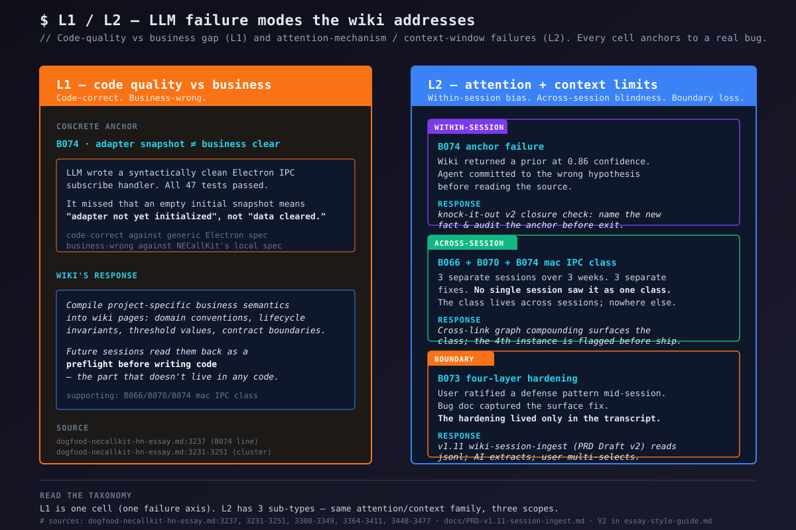
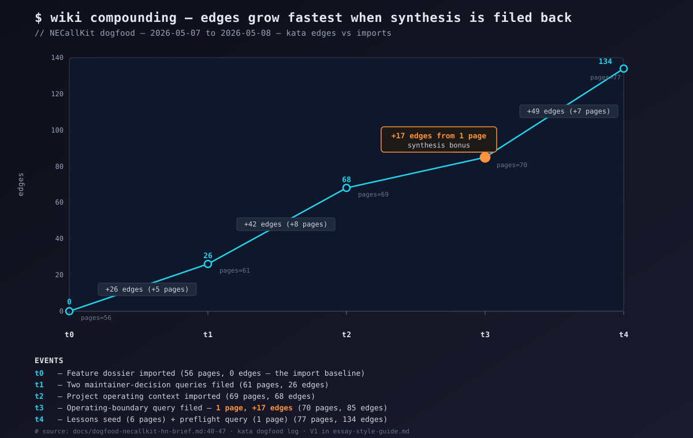

# Essay #1 公众号版 (Draft) — "代码质量已被 AI 解决。业务门限还没。"

> Status: 公众号首版草稿 · ~2200 字 · 移动端友好
> Source: HN 英文版 `2026-05-13-essay1-code-quality-vs-business-DRAFT.md`
> Style guide: `docs/essay-style-guide.md` v1.2
> Brand: Kata（保留英文）
> Date: 2026-05-13

---

# 代码质量已被 AI 解决。业务门限还没。

> 一场 4 周 NECallKit dogfood 实验的发现。

2026 年 5 月 9 日下午 4 点半左右，Claude 写完了一段看起来很干净的 Electron IPC 代码。47 个测试全部通过。

mac 摄像头还是没切。

那段 handler 在语法层面完全正确——subscribe 回调收到一个空 snapshot 时，清空通话记录缓存。bug 不在代码里，而在**"空 snapshot"这个信号本身的含义**。

NECallKit 的 adapter 在自己初始化阶段就会先吐出一个空 snapshot，**这时业务上根本没发生过"清空"**。"adapter 还没初始化好"和"数据被清掉了"在 renderer 这边看起来一模一样，只有项目自己的内部规约能区分这两种语义。

这不是"模型不够强就能避免"的 bug。代码对的是它能拿到的规约，错的是只有 NECallKit 团队自己心里有的那份规约。

（这条记在 dogfood 日志里叫 B074：`dogfood-necallkit-hn-essay.md:3237`。）

## 为什么这事值得讲

代码质量这一层，AI 已经吃了好几年了。

最初是 formatter 和 linter。然后是 type-checker 和代码 review 机器人。现在 Claude、Codex、Copilot 写整段 patch，过 review，干净 merge。每一层之前都是工程师的护城河，每一层后来都成了 commodity。

**没被吃下去的那部分**——我赌也不会被同样吃下去的——是"这段代码应该做什么"中**不存在于代码里**的那一半。

项目内部的业务语义。门限值。生命周期不变量。领域约定。2024 年某个 Slack 频道里达成的协议规则。某个工程师摸出来但从来没写下的拆卸顺序。每次有人问"等等，这在我们系统里到底是什么意思？"就要重新推导一遍的那种知识。

我把这一类失败模式叫 **L1：代码对，业务错**。这是 LLM 在真实项目上跑时的系统性故障模式。在我这 4 周 dogfood 里，它是**我们到今天还在出的代价最大的一类 bug**。

不是因为模型弱，是因为模型被问到了项目从来没写下答案的问题。

## 实验是怎么搭的

NECallKit 是一个真实的 Electron + 原生视频通话 SDK——跨平台、原生 IPC bridge、mac/win/linux、Java + JS + C++ 三种代码并存。**不是 toy fixture**。

从 2026-04-25 到 2026-05-13，我跑了一个配对实验：把这个项目的每一个 bug、每一个决策、每一次维护者查询，**都从一个 AI 维护的 wiki 走一遍**，然后看到底什么会复利。

wiki 工具叫 **Kata**（v1.4 → v1.11，6 周内迭代了 8 个版本），底座是 Andrej Karpathy 的 LLM-Wiki 原理。循环很简单：人类策展原始资料，AI 读、总结、互链、归档。

页面会**编译完成**——综合结论烤进页面里，矛盾被显式标出，查询的答案以新页面形式回填。wiki 不是"按需检索"，而是**编译好的知识层**，随项目演进而持续更新。

整个 4 周里，Claude Code 和 Codex CLI 轮班做维护 agent，跑了 200+ 个 session。我只负责策展和提问。

实验开始时我的预期很朴素——wiki 大概只是加速 cross-reference，毕竟 Electron 和 Node 这种通用知识 LLM 早就会了。也许它对我换到第二台机器开发时的 onboarding 有点用。

结果我**最先要写下来的不是 cross-reference**。是这篇文章。

## 三条 bug，同一个形状

*（说明：下面会用 B074 / B066 / B070 这种内部 bug 编号做引用锚点。你不需要记住编号，每个 bug 在出现的当行都有简短说明。编号只是为了让你能去 dogfood 日志里互查。）*

B074 不是一次性失误。三周内我修过的三条 bug，**形状完全一样**：

- **B066** —— `normalize()` 函数在数据流过的时候把 `cleared` 字段抹掉了。问题是协议把"字段缺失"和"字段显式赋成 undefined"当成两种不同的信号（一个是"没更新过"，另一个是"主动清空了"）。LLM 不知道。它看见两个 falsy 值就把它们当一回事。
- **B070** —— Electron renderer 直接调 `sdk.setCallConfig`。Windows 上能跑，mac 上 renderer 里的 `sdk` 是 null——因为 mac 上原生 SDK 住在主进程而不是 renderer。LLM 看着 Windows 那段能跑的代码，把 pattern 抄过来，**在 mac 上 ship 了一个静默 no-op**。所有测试通过。没崩。静音按钮就是不静音。
- **B074** —— 开头那个 adapter snapshot lifecycle 的故事。

（cluster 的来源：`dogfood-necallkit-hn-essay.md:3231-3251`。）

L1（左列）就是这篇文章要命名的这一族。L2（右列——单 session 内注意力偏置、跨 session pattern 盲、session 边界丢失）是另一篇文章的主题，这里先放着。

B066/B070/B074 **每一条都是：代码对的是 LLM 拿到的那份通用 Electron 规约，错的是只有 NECallKit 团队自己心里有的那份本地规约**。

三个不同的 session、三个不同时间点的 agent、三周间隔。**没有一个 session 把它当作一类来看待**。这个"类"在 chat 受限的智能里**结构上看不见**——每次 bug fix 都是局部的，pattern detection 需要"站在对话外面"。每次 session 都把代码改得严格更好，那个类却始终隐形。

那个**"站在外面"**的位置，正是 wiki 该去填的位置。wiki 不是按需查的检索系统；它是 session 之间一直在的那个**工件**，是下一个 agent 在写第一行代码之前会读的东西。

## wiki 怎么把这个口补上

整个 dogfood 我只盯着一个数字：编译完成的 wiki 里 graph 的边数，在工作周里 5 个拐点上的值。

| 时刻 | 页数 | 边数 | Δ |
|---|---:|---:|---|
| t0 — 导入 feature dossier | 56 | 0 | baseline |
| t1 — 回填 2 条维护者决策查询 | 61 | 26 | +26 / 5 新页 |
| t2 — 导入项目运行上下文 | 69 | 68 | +42 / 8 新页 |
| **t3 — 回填 1 条 operating-boundary 查询** | **70** | **85** | **+17 / 1 新页** |
| t4 — 6 条 lesson 种子 + 1 条 preflight 查询 | 77 | 134 | +49 / 7 新页 |

（出处：`dogfood-necallkit-hn-brief.md:40-47`。）

t3 是这张图的 punch line。**一条回填查询。一个新页。+17 条边。**

导入材料平均每页带 5 条边。回填一次维护者决策查询，一页带 17 条。

wiki 不是在你"装数据"的时候长起来的；wiki 是在有人**问了一个维护者要做决策的问题**、AI 把答案**带着对所有相关页面的互链**回填进去的时候长起来的。

"维护者决策查询"是有特定形状的。**不是**"这个函数干啥"——这是规约内的，LLM 早就知道。**而是**"NECallKit 在 adapter lifecycle 上的 mac IPC 拓扑是什么，我们项目里哪些模块依赖这个契约？" AI 把答案写成一个 wiki 页面，对每一个相关模块、每一条同邻域的过往 bug、每一个保护这条边界的测试都建立 cross-reference。这个页面变成一个 hub。**下一个 session 在动代码之前，会先落在这里。**

我对这四条回填查询做过三轴评分：正确性、有用性、保留价值。四条全部正确性 5/5、保留 5/5；有用性两条 5/5、两条 4/5（`dogfood-necallkit-query-acceptance.md:48-82`）。维护者打分的标准是**领域正确**，不是语法上合不合理。这些查询有用，是因为它们编码了 LLM 从代码里推不出来的那部分规约——团队自己关于"系统怎么工作"的运行判断。

dogfood 进行到一半的时候，我在日志里写下一句话，后来变成了这篇文章的整个论点：

> "wiki 应该在写代码之前编译出一个领域专属的预查询。"

（`dogfood-necallkit-hn-essay.md:2526-2527`。）t3 那个"1 页带 17 边"的瞬间就是这句话的实证。**wiki 不是参考资料，是业务语义编译。**

## 给这个 pattern 起个名

三个字，可引用：**代码对，业务错**。

抽象一点说：AI 工具在**规约内**知识上很强——被写进语言、写进框架、写进公开 API、写进标准库、写进 GitHub 上被啃过十年的那部分约定。模型知道 JavaScript 里 `subscribe` 长什么样，知道 Electron renderer 能碰到和碰不到什么，知道 `null` reference 会怎么样。这一块解决了，而且会越来越解决。

模型不知道的是**规约外**那部分。本地的真理。**你**这个 SDK 在 mac 上跨主进程和 renderer 的分割。生命周期三个阶段里同一个字段表达的三个不同含义。某个工程师在一次客户故障之后定下的 3.5 秒超时阈值。

这些都不在语言里。不在框架里。它住在三个工程师脑子里，每次有新人问错了第一个问题，就要被重新推导一遍。

经济预测有点令人不舒服但很直白：当代码质量工作不断落到 AI 手里，资深工程师的可持续贡献就**从"产出代码"迁移到"产出代码必须遵守的规则"**。

工作从"做出制品"变成"产出制品必须遵守的规约"。

wiki 是这种编译的一种形态。还会有其它形态——schema 仓库、contract test 套件、决策日志、机器可读的不变量声明。**任选一种。或者自己造一种。**

这不是一个关于"AI 弱"的故事。AI 在规约写下来的地方非常强。bug 是我们**从来没把那个不属于语言特性的部分写下来**，因为过去 15 年里没有这么做的动力。现在有了。

向上走的阶梯，是给"编译业务语义"找一套**套路**——先采纳它（accept），再按你项目的语境改造它（adapt），最后让形式淡出、只剩工作本身（transcend）。

这个动作的中文比喻就是李小龙那句"接受所有、适应所有、并超越所有"。

Kata（这篇文章里描述的那套 workflow）是其中一条阶梯；你团队的那条可能长得不一样。**重点不是 wiki，是有任何一层"被编译过的业务规约"都好**。

## 接下来

**老实承认的空白。** 我没有跑冷基线对比——同一个问题，同一个 agent，**不带 wiki** 的版本。我觉得"复利"是对的框架，但在我说它被证明之前我欠那个测试。这个空缺已经在 dogfood 日志里标记好了（`dogfood-necallkit-hn-essay.md:996-999`），是下一个实验。

**范围声明。** 这篇文章讲的是 Kata 的 **Phase 1 reach**——AI-paired engineering。Kata 的 core 是**基于 Karpathy LLM-Wiki 基底的自进化知识体系**（自闭环回填 + auto-dreaming，让冻结的页面在相关性回归时复活）。Phase 1 是把这个 core 应用到项目记忆。

**Phase 2** 已经在设计——团队 spec 制定 + 分歧管理作为自闭环。还没实现。本文里"复利"这套论证对 core 通用，但具体的执行动作只针对 Phase 1。

**下一个代码实验。** v1.11 `wiki-session-ingest`（PRD Draft v2: `docs/PRD-v1.11-session-ingest.md`）——读当前 CLI session、抽取知识点、让用户多选哪些回填进 wiki 的一个 skill。它是对**另一类**失败模式（L2：知识在对话里诞生，在 session 边界处死亡）的结构性回应，那是下一篇文章的主题。

---

**可点击的引用链：**

- Kata repo：https://github.com/surebeli/kata
- 完整 dogfood 日志（完整证据链）：`docs/dogfood-necallkit-hn-essay.md`
- B074 锚点：第 3237 行
- v1.11 session-ingest PRD：`docs/PRD-v1.11-session-ingest.md`
- 这篇文章是按什么风格写的：`docs/essay-style-guide.md`

---

你不必非得用 Kata 来做这件事。给你团队选一套**套路**——fork 我们的、写你自己的、或者干脆采纳完全不同的另一种。重点不是工具，是那一层。

> *—— 一个 AI native dev 的探索手记。接受所有、适应所有、并超越所有。*
