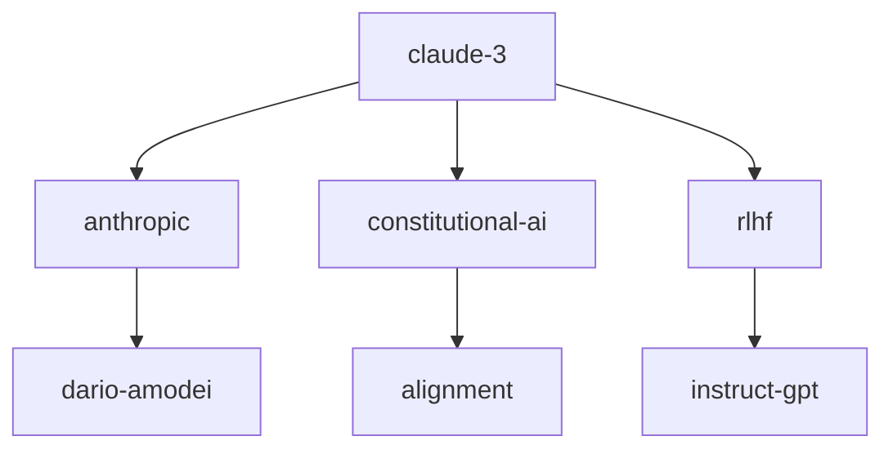

# wiki-graph

Structured graph queries over the wiki — **without a persistent graph store**.

The wiki already has a knowledge graph: every `[[wikilink]]` is an edge, every
page is a node, every frontmatter field is a property. This skill just computes
over that graph on demand. Each invocation scans the markdown files, builds an
in-memory graph, runs the query, prints the answer, and exits. Nothing is
cached — the files are the source of truth, always.

> Karpathy's wiki treats the filesystem as the database. `wiki-graph` treats the
> filesystem as the graph.

## When to use

- Structured Dataview-style questions: _"all `type: model` pages tagged
  `transformer` updated since March"_
- Traversal questions: _"what's within 2 hops of `[[claude-3]]`?"_
- Comparison discovery: _"what's the shortest path between `[[gpt-4]]` and
  `[[llama-3]]` — do any concepts bridge them?"_
- Topology questions: _"which pages are hubs? which are orphans?"_
- Visualizing a subgraph: render a Mermaid diagram of a cluster or neighborhood

`wiki-search` is for **"find pages about X"** (ranked text relevance).
`wiki-graph` is for **"pages where property P holds"** and **"pages connected
to X"** (structural queries).

## Implementation

The graph algorithm is implemented in `plugin/scripts/graph_query.py`. **The
script is the source of truth; the prose below explains its behavior.** Don't
reimplement the BFS, hub scoring, or tier filtering by reading files yourself —
shell out to the script and format its JSON output.

```bash
# Stats (always cheap — good warm-up call)
python {plugin_root}/scripts/graph_query.py --wiki {wiki_path} --mode stats

# Neighbors of a page, depth 2
python {plugin_root}/scripts/graph_query.py --wiki {wiki_path} \
    --mode neighbors --seed claude-3 --depth 2

# Shortest path between two pages
python {plugin_root}/scripts/graph_query.py --wiki {wiki_path} \
    --mode shortest-path --src attention --dst claude-3

# Hubs (top-N by inbound + 0.5·outbound), filtered to active tier
python {plugin_root}/scripts/graph_query.py --wiki {wiki_path} \
    --mode hubs --limit 20 --tier active

# Orphans + leaves
python {plugin_root}/scripts/graph_query.py --wiki {wiki_path} --mode orphans

# Cluster around a tag
python {plugin_root}/scripts/graph_query.py --wiki {wiki_path} \
    --mode cluster --tag transformer
```

The script outputs JSON. The skill's job is to call the script, then format
the JSON for the user (text/json/mermaid per `--format`). Mermaid rendering
for `neighbors`, `shortest-path`, and `cluster` is the skill's responsibility,
not the script's.

`{plugin_root}` resolves to the directory containing `.claude-plugin/`.

## Pre-flight

Orientation is **not required** — this skill runs cold against the file layout.
It reads SCHEMA.md only to know which frontmatter fields are reserved types vs.
free-form strings.

```
read_file {wiki_path}/SCHEMA.md  (optional — for type field names)
```

## Steps

① **Parse arguments.** Exactly one of `--query`, `--neighbors`,
   `--shortest-path`, `--hubs`, `--orphans`, `--cluster` should be set
   (they are different query modes). `--format` and `--limit` apply to all
   modes.

② **Scan the wiki** (shared by all modes):
   Walk every `.md` file outside `raw/`. For each file extract:
   - Path (relative to wiki root) — the node id
   - YAML frontmatter — the node properties (title, type, tags, created, updated,
     published_at, ingested_at, tier_override, and every SCHEMA.md custom dimension)
   - Outbound `[[wikilinks]]` in the body — the outbound edges
   - **Computed tier** — per SCHEMA.md `memory_tiers`: pick the driving field,
     compare age to thresholds, apply any `tier_override:` pin

   **Tier filtering depends on mode:**
   - `--query`, `--hubs`, `--orphans`, `--cluster` — filter nodes by `--tier`
     (default `active` when tiers are enabled, else `all`). These are
     ambient-state queries and should reflect the "focus" surface.
   - `--neighbors`, `--shortest-path` — include **all tiers** by default. The
     user named a specific seed, so connectivity matters more than surface
     focus. Each result annotates its tier (`[active]`/`[archived]`/`[frozen]`)
     so the user can eyeball where archived bridge concepts live. Pass
     `--tier=active` explicitly to restrict.

   Build three in-memory structures:
   ```
   nodes: {id → {properties}}
   out_edges: {id → [target_id, ...]}
   in_edges:  {id → [source_id, ...]}   # inverted while walking
   ```

   Resolve `[[wikilinks]]` to node ids by matching the link text against page
   titles (frontmatter `title`) first, then filename stems. Unresolved links
   become dangling edges — reported in the `--orphans` / `wiki-lint` modes but
   not treated as nodes.

③ **Dispatch to the query mode.**

### Mode: `--query "<expression>"`

Dataview-style filter over frontmatter. Supports:
- Field equality: `type: entity`, `tags contains transformer`
- Comparisons on dates/numbers: `updated > 2025-01`, `sources >= 3`
- Boolean combinators: `AND`, `OR`, `NOT`
- Parentheses for grouping

```
--query "type: entity AND tags contains model AND updated > 2025-01"
--query "type: comparison OR (type: concept AND tags contains attention)"
--query "NOT (tags contains stub) AND sources >= 3"
```

Evaluation: iterate nodes, evaluate expression against each node's properties,
collect matches. Sort by `updated` descending by default (override with
`--sort=<field>`).

### Mode: `--neighbors <page> [--depth=N]`

BFS from the starting page over `out_edges ∪ in_edges` (undirected traversal —
a wiki link is a bidirectional relation in practice, even if stored one-way).
Default depth is 1; cap at 4 to keep output readable.

Return the layered neighborhood:
```
depth 0: [[claude-3]]                         (seed)
depth 1: [[anthropic]], [[constitutional-ai]], [[rlhf]]
depth 2: [[alignment]], [[dario-amodei]], ...
```

Each neighbor line also carries its `type` and top 2 tags so the user can scan
for the ones that matter.

### Mode: `--shortest-path <a>,<b>`

Undirected BFS from `a` to `b`. If no path exists, say so and suggest the
closest candidates (smallest BFS frontier intersection). If multiple shortest
paths of the same length exist, return up to 3.

Output the path with edge labels (frontmatter `type` of each node):
```
[[claude-3]] (entity) → [[rlhf]] (concept) → [[instruct-gpt]] (entity) → [[gpt-4]] (entity)
```

This is often the most useful mode — it surfaces **bridge concepts** between
two entities the user didn't realize were connected.

### Mode: `--hubs [--limit=20]`

Sort all nodes by `|in_edges| + 0.5·|out_edges|` descending (inbound links
matter more — being linked to is a stronger signal than linking out). Return
the top `--limit` with their link counts.

### Mode: `--orphans`

Two classes:
- **True orphans** — no inbound and no outbound links (isolated nodes)
- **Leaves** — inbound links only, no outbound (dead-ends — not broken, but
  worth reviewing)

Report both separately. True orphans are almost always bugs (the ingest
forgot to cross-reference). Leaves are sometimes intentional (a stub page
waiting to be fleshed out).

### Mode: `--cluster=<tag>`

Collect all nodes carrying `<tag>` in frontmatter. Report:
- Member count
- Most-linked member (the cluster anchor)
- Intra-cluster edges (links between members) vs. external edges (links leaving
  the cluster)
- Density = `intra_edges / (N·(N-1)/2)` — high density means the cluster is
  self-referential; low density means it's a loose grouping

Offers a quick way to ask _"is this tag actually a coherent topic, or just a
shelf?"_

④ **Format output.**

- `--format=text` (default) — human-readable, excerpt above
- `--format=json` — machine-readable, for piping to other tools (e.g. `jq`)
- `--format=mermaid` — a `graph TD` block the user can paste into Obsidian or
  GitHub markdown. Best with `--neighbors`, `--shortest-path`, or `--cluster`.

Mermaid example for `--neighbors claude-3 --depth=2 --format=mermaid`:


⑤ **Suggested next actions.** Based on what the query found:
- Orphans detected → suggest `wiki-lint --fix` to surface cross-reference candidates
- A cluster with zero synthesis page → suggest `wiki-query --file "synthesis of {tag}"`
- A shortest path through a surprising bridge → suggest `wiki-query` to write that
  connection up as a comparison page

## Output format

```
[Operation] wiki-graph | {mode}: {argument}

[Scanned] {N} pages, {M} edges ({K} dangling)

[Results]
{mode-specific body}

[Summary]
{1–2 sentence interpretation of the result}

[Suggested next]
→ {next skill invocation}
```

---

## Why there is no persistent graph

A persistent graph store (Neo4j, an index file, a pickled networkx) would be
faster for very large wikis, but it introduces a second source of truth. The
moment the agent updates a page and forgets to update the graph, queries
silently lie.

Karpathy's design keeps **the filesystem as the only source of truth**. Every
query is computed from the current state of the files. `wiki-graph` honors that
rule: it builds and throws away its graph every call. A scan of several hundred
pages is milliseconds — cheaper than the overhead of keeping an index coherent.

If the wiki grows past the size where ad-hoc scans feel slow (typically several
thousand pages), the right upgrade is `qmd` in MCP mode — same model, but with
a purpose-built search engine. A dedicated graph DB is rarely worth it.

## Notes for the agent

- Respect `SCHEMA.md` field names — do not invent frontmatter keys. If the user's
  wiki uses `kind:` instead of `type:`, honor that.
- `[[wikilinks]]` may use aliases (`[[claude-3|Claude 3 Opus]]`) — resolve by
  the pre-pipe id.
- Treat heading-anchor links (`[[page#section]]`) as edges to `page`.
- Embedded images (`![[image.png]]`) are **not** edges — they belong to the
  asset layer, not the concept graph.
- For large wikis, do not load every file body into memory — only read
  frontmatter blocks and grep wikilinks out of the body. This is the hot path.
- This skill is read-only. It does not write pages, does not update `index.md`,
  and does not append to `log.md`.
